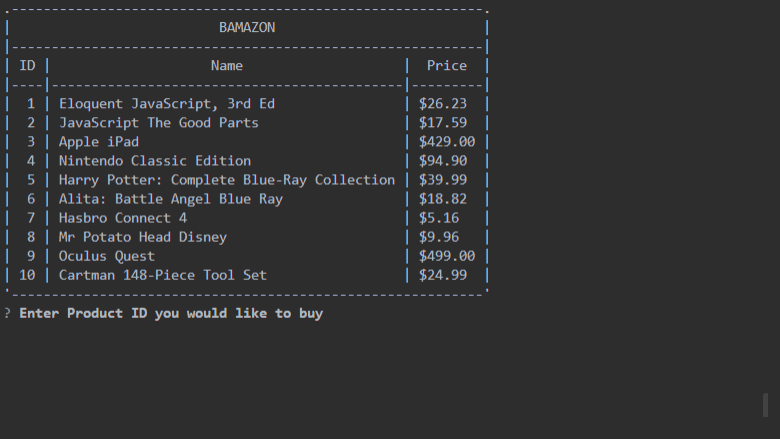
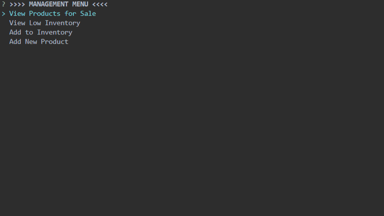
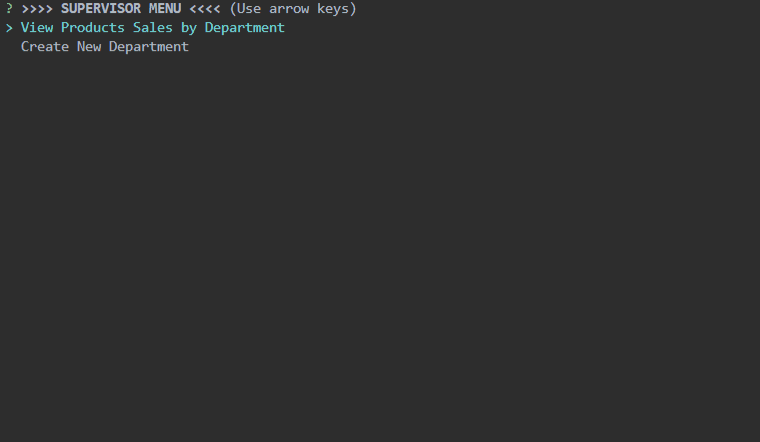

<h1 align="center">Welcome to Bamazon CLI App 👋</h1>
<p>
  
  
  
</p>

> Bamazon CLI app is a Amazon-like storefront with three modes interfaces. The customer mode will take in orders from customers and deplete stock from database inventory. The manager mode provide the options to view inventory products, view low inventory, add more items of current products, and add new products. The supervisor mode provides the options to view product sales across store's departments, and add new departments to the database.

## Prerequisites

- npm >=5.5.0
- node >=9.3.0
- SQL Server database

## Install

```sh
npm install
```

### Installation Notes

- Run the queries from 'bamazon.sql' file on your SQL Server to create the database

## Usage

##### From Terminal run the following commands:
```sh
node bamazonCustomer
```


```sh
node bamazonManager
```


```sh
node bamazonSupervisor
```


## Built With

* [Ascii Table](https://www.npmjs.com/package/ascii-table) - Easy table output for node debugging.
* [Inquirer](https://www.npmjs.com/package/inquirer) - A collection of common interactive command line user interfaces.
* [Mysql](https://www.npmjs.com/package/mysql) - This is a node.js driver for mysql.

## Author

👤 **Elmer C. Galo**

* Website: https://github.com/galoelmer

## 🤝 Contributing

Contributions, issues and feature requests are welcome!<br />

## Show your support

Give a ⭐️ if this project helped you!

## 📝 License

Copyright © 2019 [Elmer C. Galo](https://github.com/galoelmer).<br />
This project is [MIT](https://github.com/kefranabg/readme-md-generator/blob/master/LICENSE) licensed.

